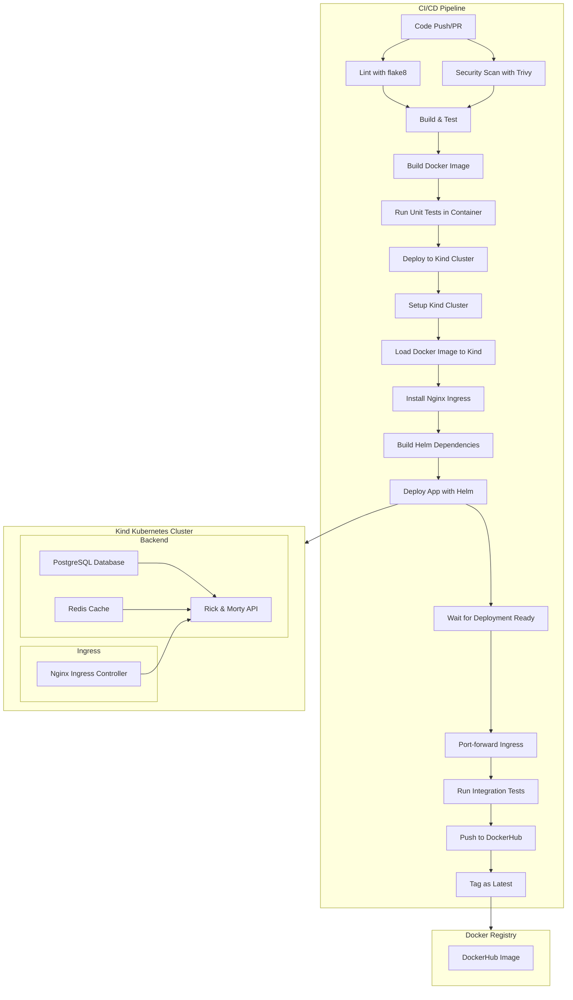

# Rick & Morty CI/CD Demo App

A containerized **Rick & Morty API** application deployed using **Kubernetes**, **Helm**, and CI/CD pipelines. This demo includes PostgreSQL, Redis, and Nginx Ingress, and is designed for easy local and CI/CD testing.

---

## Architecture



---

## Features

- Django REST API serving Rick & Morty characters
- **PostgreSQL** for persistent storage
- **Redis** for caching
- **Nginx Ingress** for routing
- CI/CD pipeline for automated testing and deployment
- Helm charts for easy Kubernetes deployment
- Integration tests included

---

## Requirements

- [Docker](https://www.docker.com/)
- [Kubernetes cluster](https://kubernetes.io/docs/setup/) (or [kind](https://kind.sigs.k8s.io/) for local testing)
- [Helm](https://helm.sh/docs/intro/install/) v3.x
- Python >= 3.11 (for local testing)
- kubectl CLI

---

## Setup & Deployment

### 1. Clone Repository

```bash
git clone https://github.com/yourusername/rickmorty-cicd-demo.git
cd rickmorty-cicd-demo
```

### 2. Add Required Helm Repositories

```bash
helm repo add bitnami https://charts.bitnami.com/bitnami
helm repo add ingress-nginx https://kubernetes.github.io/ingress-nginx
helm repo update
```

### 3. Install Nginx Ingress Controller (if not already installed)

```bash
helm install ingress-nginx ingress-nginx/ingress-nginx \
    --namespace ingress-nginx \
    --create-namespace \
    --set controller.service.type=NodePort \
    --set controller.hostPort.enabled=true \
    --set controller.nodeSelector."kubernetes\.io/os"=linux \
    --set controller.ingressClassResource.default=true \
    --wait --timeout=300s
```

### 4. Build Helm Dependencies

```bash
helm dependency build helm/rickmorty-api-chart
```

### 5. Deploy with Helm

```bash
helm upgrade --install rickmorty helm/rickmorty-api-chart \
    --set app.image.tag=latest \
    --wait --timeout=300s
```

> ⚠️ **Note**: The deployment will automatically install PostgreSQL and Redis as dependencies. Wait for all pods to be ready before accessing the API.

### 6. Verify Deployment

```bash
kubectl get pods
kubectl wait --for=condition=ready pod --all --timeout=300s
```

### 7. Access the API

#### Option A: Port Forward (Local Development)
```bash
kubectl port-forward svc/rickmorty-rickmorty-api 8000:8000
```
API accessible at: `http://localhost:8000/api/characters/`

#### Option B: Through Ingress (if configured)
```bash
kubectl port-forward --namespace ingress-nginx svc/ingress-nginx-controller 8080:80
```
API accessible at: `http://localhost:8080/api/characters/`

---

## Testing

### Integration Test (Local)

```bash
export API_URL="http://localhost:8000/api/characters/"
python3 - <<EOF
import requests
import json

try:
    r = requests.get("${API_URL}")
    assert r.status_code == 200, f"Expected 200 but got {r.status_code}"
    data = r.json()
    assert "results" in data, "No results key in API response"
    print("✅ Integration test passed!")
    print(f"Found {len(data['results'])} characters")
except Exception as e:
    print(f"❌ Integration test failed: {e}")
EOF
```

### Unit Tests

```bash
cd app
pip install -r requirements.txt
pip install pytest
pytest tests/unit
```

### CI/CD Pipeline

The GitHub Actions pipeline automatically:
1. Lints code with flake8
2. Runs security scans with Trivy
3. Builds and tests Docker image
4. Deploys to kind cluster
5. Runs integration tests
6. Pushes successful builds to DockerHub

---

## API Documentation

### Base URL
```
http://<your-host>/api/
```

### Endpoints

| Method | Endpoint            | Description              |
|--------|-------------------- |--------------------------|
| GET    | `/api/characters/`  | List all characters      |
| GET    | `/api/characters/{id}/` | Get a single character |
| GET    | `/health/`          | Health check endpoint    |

### Example Response

```json
{
  "count": 826,
  "next": "http://localhost:8000/api/characters/?page=2",
  "previous": null,
  "results": [
    {
      "id": 1,
      "name": "Rick Sanchez",
      "status": "Alive",
      "species": "Human",
      "type": "",
      "gender": "Male",
      "origin": {
        "name": "Earth (C-137)",
        "url": "http://localhost:8000/api/location/1/"
      },
      "location": {
        "name": "Citadel of Ricks",
        "url": "http://localhost:8000/api/location/3/"
      },
      "image": "https://rickandmortyapi.com/api/character/avatar/1.jpeg",
      "episode": [
        "http://localhost:8000/api/episode/1/",
        "http://localhost:8000/api/episode/2/"
      ],
      "url": "http://localhost:8000/api/character/1/",
      "created": "2017-11-04T18:48:46.250Z"
    }
  ]
}
```

---

## Configuration

### Helm Values

Customize the deployment by modifying `helm/rickmorty-api-chart/values.yaml`:

```yaml
# Application configuration
app:
  name: rickmorty-api
  image:
    repository: andriifedotov/rickmorty-api
    tag: latest
    pullPolicy: IfNotPresent
  port: 8000
  replicaCount: 1

# Service configuration
service:
  type: ClusterIP
  port: 8000

# Ingress configuration
ingress:
  enabled: true
  className: nginx
  annotations: {}
  hosts:
    - host: localhost
      paths:
        - path: /
          pathType: Prefix
  tls: []

# PostgreSQL configuration (Bitnami chart)
postgresql:
  enabled: true
  auth:
    postgresPassword: "postgres"
    username: "rickmorty"
    password: "rickmorty"
    database: "rickmorty"
  primary:
    persistence:
      enabled: true
      size: 1Gi

# Redis configuration (Bitnami chart)
redis:
  enabled: true
  auth:
    enabled: false
  master:
    persistence:
      enabled: false
```

### Environment Variables

The application uses these environment variables:

- `DATABASE_URL`: PostgreSQL connection string
- `REDIS_URL`: Redis connection string  
- `DEBUG`: Django debug mode (default: False)
- `ALLOWED_HOSTS`: Django allowed hosts

---

## Development

### Local Development Setup

1. **Set up Python environment:**
```bash
cd app
python3 -m venv venv
source venv/bin/activate  # On Windows: venv\Scripts\activate
pip install -r requirements.txt
```

2. **Run local services:**
```bash
docker-compose up
```

### Building Docker Image

```bash
docker build -t andriifedotov/rickmorty-api:latest ./app
docker push andriifedotov/rickmorty-api:latest
```

---

## Troubleshooting

### Common Issues

1. **Pods stuck in Pending state:**
   ```bash
   kubectl describe pod <pod-name>
   kubectl get events --sort-by=.metadata.creationTimestamp
   ```

2. **Database connection issues:**
   ```bash
   kubectl logs deployment/rickmorty-rickmorty-api
   kubectl exec -it deployment/rickmorty-postgresql -- psql -U postgres
   ```

3. **Ingress not working:**
   ```bash
   kubectl get ingress
   kubectl describe ingress rickmorty-rickmorty-api
   kubectl logs -n ingress-nginx deployment/ingress-nginx-controller
   ```

### Cleanup

```bash
helm uninstall rickmorty
helm uninstall ingress-nginx -n ingress-nginx
kubectl delete namespace ingress-nginx
```

---

## Contributing

1. Fork the repository
2. Create a feature branch (`git checkout -b feature/amazing-feature`)
3. Commit your changes (`git commit -m 'Add some amazing feature'`)
4. Push to the branch (`git push origin feature/amazing-feature`)
5. Open a Pull Request

---

## License

MIT License © Andrii Fedotov

---

## Repository Structure

```
.
├── .github/
│   └── workflows/
│       └── ci-cd.yml          # GitHub Actions pipeline
├── app/                       # Django application
│   ├── rickmorty/            # Django project
│   ├── requirements.txt      # Python dependencies
│   ├── Dockerfile           # Container image
│   └── tests/              # Test files
├── helm/
│   └── rickmorty-api-chart/  # Helm chart
│       ├── Chart.yaml       # Chart metadata
│       ├── values.yaml      # Default values
│       └── templates/       # Kubernetes templates
└── README.md               # This file
```
